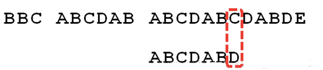

# KMP算法详解

## 暴力匹配

规定i是主串S的下标，j是模式T的下标。现在假设现在主串S匹配到 i 位置，模式串T匹配到 j 位置。

如果当前字符匹配成功（即S[i] = T[j]），则i++，j++，继续匹配下一个字符；
如果失配（即S[i] != T[j]），令i = i - (j - 1)，j = 0。相当于每次匹配失败时，i 回溯到本次失配起始字符的下一个字符，j 回溯到0。

## KMP算法

KMP算法是一种改进的字符串匹配算法，由D.E.Knuth，J.H.Morris和V.R.Pratt提出的，因此人们称他为克努特—莫里斯—普拉特操作（简称KMP算法）。KMP算法的核心是利用匹配失败后的信息，尽量减模式串与主串的匹配次数以达到快速匹配的目的。具体实现就是通过一个next()函数实现，函数本身包含了模式串的局部匹配信息，KMP算法的时间复杂度O(m+n)，而使用暴力匹配的时间复杂度则是O(mn)。

## KMP算法原理

举例来说，有一个字符串 Str1 = “BBC ABCDAB ABCDABCDABDE”，判断里面是否包含另一个字符串 Str2 = “ABCDABD”？

1、首先，用Str1的第一个字符和Str2的第一个字符去比较，不符合，关键词向后移动一位。

2、重复第一步，还是不符合，再后移。

3、一直重复，直到Str1有一个字符与Str2的第一个字符符合为止。

4、接着比较字符串和搜索词的下一个字符，还是符合。

5、遇到Str1有一个字符与Str2对应的字符不符合。

6、这时候想到的是继续遍历Str1的下一个字符，重复第1步。

7、其实这是很不明智的，因为此时”ABCDAB”已经比较过了，没有必要再做重复的工作，一个基本事实是，当空格与D不匹配时，你其实知道前面六个字符是”ABCDAB”。KMP算法的想法是，设法利用这个已知信息，不要把”搜索位置“移回已经比较过的位置，继续把他向后移，这样就提高了效率。怎么做到把刚刚重复的步骤省略掉？可以对Str2计算出一张《匹配表》，这张表的产生在后面介绍。

8、已知空格与D不匹配时，前面六个字符”ABCDAB”是匹配的。查表可知，最后一个匹配字符B对应的”部分匹配值”为2，因此我们只需要让模式串Str2的下标移动到对应下标为2的位置，也就是C，此时Str1的下标还是保持不变，在空格处，这样就避免了Str1下标回溯到第6步了，这样就大大减少了Str1的比较次数。

9、因为空格与Ｃ不匹配，搜索词还要继续往后移。这时已匹配的字符串为”AB”，最后一个匹配字符B对应的”部分匹配值”为0。因此我们只需要让模式串Str2的下标移动到对应下标为0的位置，也就是A，此时Str1的下标还是保持不变。

10、因为空格与A不匹配，并且此时并没有匹配的字符，因此只能继续后移一位。

11、然后逐位比较，直到发现C与D不匹配。

12、因为C与D不匹配，这时已匹配的字符串为”ABCDAB”，最后一个匹配字符B对应的”部分匹配值”为2。因此我们只需要让模式串Str2的下标移动到对应下标为2的位置，也就是C，此时Str1的下标还是保持不变。

13、然后逐位比较，直到搜索词的最后一位，发现完全匹配，于是搜索完成。

## 时间复杂度分析

中n为文本串长度，m为模式串长度，因为在匹配的过程中，根据匹配表不断调整匹配的位置，可以看出匹配的过程是O(n)，之前还要单独生成next数组，时间复杂度是O(m)。所以整个KMP算法的时间复杂度是O(n+m)的。

暴力的解法显而易见是O(n * m)，所以**「KMP在字符串匹配中极大的提高的搜索的效率。」**

## KMP的匹配表

介绍匹配表如何产生之前，我们首先介绍什么是前缀什么是后缀？

- 什么是前缀：包含首字母但不包含尾字母的所有子串。
- 什么是后缀：包含尾字母但不包含首字母的所有子串。

这里以模式串“ABCAB”为例，该模式串的前缀和后缀依次如下图：

那么模式串“ABCAB”的匹配值就是 **前缀和后缀最大相同子串的长度** ：AB（2）

接下来，我们以模式串“ABCAB”为例，逐步获取该模式串的匹配表：

- A：匹配值为0
- AB：匹配值为0
- ABC：匹配值为0
- ABCA：匹配值为1
- ABCAB：匹配值为2

通过逐步分解模式串“ABCAB”，将每个子串的匹配值转化为匹配表：

## 匹配表

匹配表是用来回退的，它记录了模式串与主串(文本串)不匹配的时候，模式串应该从哪里开始重新匹配。

所以匹配表具有告诉我们当前位置匹配失败，跳到之前已经匹配过的地方的能力，文本串指针不需要变化，只需要移动模式串指针。

长度为前1个字符的子串`a`，最长相同前后缀的长度为0。

长度为前2个字符的子串`aa`，最长相同前后缀的长度为1。

长度为前3个字符的子串`aab`，最长相同前后缀的长度为0。

长度为前4个字符的子串`aaba`，最长相同前后缀的长度为1。

长度为前5个字符的子串`aabaa`，最长相同前后缀的长度为2。

长度为前6个字符的子串`aabaaf`，最长相同前后缀的长度为0。

那么把求得的最长相同前后缀的长度就是对应匹配表的元素：

| 下标i  | 0    | 1    | 2    | 3    | 4    | 5    |
| ------ | ---- | ---- | ---- | ---- | ---- | ---- |
| 模式串 | a    | a    | b    | a    | a    | f    |
| 匹配表 | 0    | 1    | 0    | 1    | 2    | 0    |

可以看出模式串与匹配表对应位置的数字表示的就是：**下表i之前（包括i）的字符串中，有多大长度的相同前缀后缀。**

再来看一下如何利用 匹配表找到 当字符不匹配的时候应该指针应该移动的位置。如动画所示：

找到的不匹配的位置， 那么此时我们要看它的前一个字符的匹配表的数值是多少。

为什么要前一个字符的匹配表的数值呢，因为要找前面字符串的最长相同的前缀和后缀。

## 匹配表与next数组

next数组就可以是匹配表，但是很多实现都是把匹配表统一减一（右移一位，初始位置为-1）之后作为next数组。

为什么这么做呢？

其实**「这并不涉及到KMP的原理，而是不同的代码实现，next数组即可以就是匹配表，也可以是前缀表右移一位，初始位置为-1。」**

## 构造next数组

**构造next数组其实就是计算模式串s，匹配表的过程。**主要有如下三步：

1. 初始化
2. 处理前后缀不相同的情况
3. 处理前后缀相同的情况

现在有串P=abaabca，各个子串的最大公共前后缀长度如下表所示：

这样，公共前后缀最长长度就会和串P的每个字符产生一种对应关系：

这个表的含义是在当前字符作为最后一个字符时，当前子串所拥有的公共前后缀最长长度。例如当c作为最后一个字符时，当前子串abaabc并没有公共前后缀。
接下来我们就用这个表来引出next数组，next 数组的值是除当前字符外（注意不包括当前字符）的公共前后缀最长长度，相当于把上表做一个变形，将表中公共前后缀最长长度全部右移一位，第一个值赋为-1。例如c对应next值的意义是，c之前（不包括c）的子串abaab所拥有的公共前后缀最长长度为2，我们称next数组中的值为失效函数值，也就是c的失效函数值为2。[丢失了最后一位，因为最后一位匹配不上时，要看前一位的最长公共串，所以可以丢失]

因为右移一位，所以next[1]始终等于0，next[0]=-1可以认为第一个字符就没匹配上，需要模式串和原串指针都需要+1。

