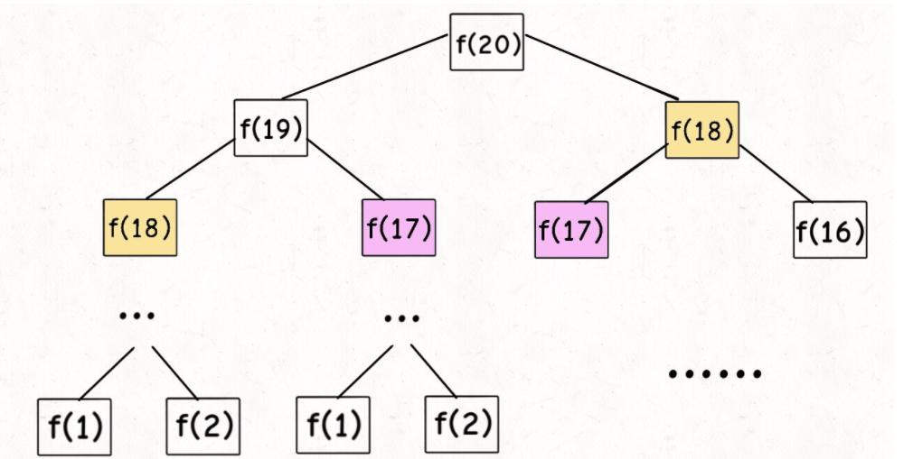
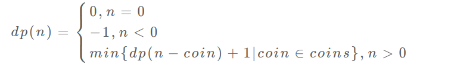

# 动态规划

动态规划问题的一般形式就是求最值。

求解动态规划的核心问题是穷举。

动态规划的穷举有点特别，因为这类问题**存在「重叠子问题」**，如果暴力穷举的话效率会极其低下，所以需要「备忘录」或者「DP table」来优化穷举过程，避免不必要的计算。

动态规划问题一定会**具备「最优子结构」**，才能通过子问题的最值得到原问题的最值。

虽然动态规划的核心思想就是穷举求最值，但是问题可以千变万化，穷举所有可行解其实并不是一件容易的事，只有列出**正确的「状态转移方程」**才能正确地穷举。

重叠子问题、最优子结构、状态转移方程就是**动态规划三要素**，在实际的算法问题中，**写出状态转移方程是最困难的**。


## 1. 斐波那契数列

### 1.1暴力递归

递归形式：

```
int fib(int N) {
    if (N == 1 || N == 2) return 1;
    return fib(N - 1) + fib(N - 2);
}
```

这样写代码虽然简洁易懂，但是十分低效：




**但凡遇到递归的问题，最好画出递归树，这对分析算法的复杂度，寻找算法低效的原因有巨大帮助**

递归算法时间复杂度怎么计算？子问题个数*解决一个子问题需要的时间。

​	子问题个数，即递归中节点的总数，二叉树节点总数是指数级别，所以子问题个数为O(2^n)。

​	解决一个子问题的时间，只有一个加法`fib(N - 1) + fib(N - 2)`操作，时间为O(1)。

​	所以这个算法的时间复杂度为二者相乘，即O(2^n)。

观察递归树，很明显发现算法低效的原因，存在大量的重复计算。

这就是动态规划问题的第一个性质：**重叠子问题**。下面我们想办法解决这个问题。


### 1.2 带备忘录的递归解法

既然耗时的原因是重复计算，那么我们可以打造一个备忘录，每次算出某个子问题答案后，记到备忘录里面，每次遇到一个子问题，先去备忘录里查。一般使用一个数组或者哈希表充当备忘录。

```
int fib(int N) {
    if (N < 1) return 0;
    // 备忘录全初始化为 0
    vector<int> memo(N + 1, 0);
    // 进行带备忘录的递归
    return helper(memo, N);
}
 
int helper(vector<int>& memo, int n) {
    // base case 
    if (n == 1 || n == 2) return 1;
    // 已经计算过
    if (memo[n] != 0) return memo[n];
    memo[n] = helper(memo, n - 1) + helper(memo, n - 2);
    return memo[n];
}
```

由于本算法不存在冗余计算，子问题就是 `f(1)`, `f(2)`, `f(3)` ... `f(20)`，数量和输入规模n成正比，所以子问题个数为O(n)，解决一个子问题的时间同上，时间为O(1)，所以本算法的时间复杂度为O(n)。

至此，带备忘录的递归解法的效率已经和迭代的动态规划解法一样了。实际上，这种解法和迭代的动态规划已经差不多了，只不过这种方法叫做「自顶向下」，动态规划叫做「自底向上」。

啥叫「自顶向下」？注意我们刚才画的递归树（或者说图），是从上向下延伸，都是从一个规模较大的原问题比如说 `f(20)`，向下逐渐分解规模，直到 `f(1)` 和 `f(2)` 这两个 base case，然后逐层返回答案，这就叫「自顶向下」。

啥叫「自底向上」？反过来，我们直接从最底下，最简单，问题规模最小的 `f(1)` 和 `f(2)` 开始往上推，直到推到我们想要的答案 `f(20)`，这就是动态规划的思路，这也是为什么动态规划一般都脱离了递归，而是由循环迭代完成计算。


### 1.3 dp数组的迭代解法

「自底向上」推算

```
int fib(int N) {
    if (N == 0) return 0;
    if (N == 1) return 1;
    vector<int> dp(N + 1, 0);
    // base case
    dp[1] = dp[2] = 1;
    for (int i = 3; i <= N; i++)
        dp[i] = dp[i - 1] + dp[i - 2];
    return dp[N];
}
```

这里，引出「状态转移方程」这个名词，实际上就是描述问题结构的数学形式：


为啥叫「状态转移方程」？其实就是为了听起来高端。你把 `f(n)` 想做一个状态 `n`，这个状态 `n` 是由状态 `n - 1` 和状态 `n - 2` 相加转移而来，这就叫状态转移，仅此而已。

你会发现，上面的几种解法中的所有操作，例如 `return f(n - 1) + f(n - 2)`，`dp[i] = dp[i - 1] + dp[i - 2]`，以及对备忘录或 DP table 的初始化操作，都是围绕这个方程式的不同表现形式。可见列出「状态转移方程」的重要性，它是解决问题的核心。而且很容易发现，其实状态转移方程直接代表着暴力解法。

**千万不要看不起暴力解，动态规划问题最困难的就是写出这个暴力解，即状态转移方程**。只要写出暴力解，优化方法无非是用备忘录或者 DP table，再无奥妙可言。

这个例子的最后，讲一个细节优化。细心的读者会发现，根据斐波那契数列的状态转移方程，当前状态只和之前的两个状态有关，其实并不需要那么长的一个 DP table 来存储所有的状态，只要想办法存储之前的两个状态就行了。所以，可以进一步优化，把空间复杂度降为 O(1)：

```
int fib(int n) {
    if (n == 2 || n == 1) 
        return 1;
    int prev = 1, curr = 1;
    for (int i = 3; i <= n; i++) {
        int sum = prev + curr;
        prev = curr;
        curr = sum;
    }
    return curr;
}
```

这个技巧就是所谓的「**状态压缩**」，如果我们发现每次状态转移只需要 DP table 中的一部分，那么可以尝试用状态压缩来缩小 DP table 的大小，只记录必要的数据，上述例子就相当于把DP table 的大小从 `n` 缩小到 2。后续的动态规划章节中我们还会看到这样的例子，一般来说是把一个二维的 DP table 压缩成一维，即把空间复杂度从 O(n^2) 压缩到 O(n)。

斐波那契数列的例子严格来说不算动态规划，因为没有涉及求最值，以上旨在说明重叠子问题的消除方法，演示得到最优解法逐步求精的过程。下面，看第二个例子，凑零钱问题。


## 2. 凑零钱问题

先看下题目：给你 `k` 种面值的硬币，面值分别为 `c1, c2 ... ck`，每种硬币的数量无限，再给一个总金额 `amount`，问你**最少**需要几枚硬币凑出这个金额，如果不可能凑出，算法返回 -1 。

### 2.1 暴力递归

首先，这个问题是动态规划问题，因为它具有「最优子结构」的。**要符合「最优子结构」，子问题间必须互相独立**。

回到凑零钱问题，为什么说它符合最优子结构呢？比如你想求 `amount = 11` 时的最少硬币数（原问题），如果你知道凑出 `amount = 10` 的最少硬币数（子问题），你只需要把子问题的答案加一（再选一枚面值为 1 的硬币）就是原问题的答案。因为硬币的数量是没有限制的，所以子问题之间没有相互制，是互相独立的。


那么，既然知道了这是个动态规划问题，就要思考**如何列出正确的状态转移方程**？

1、**确定 base case**，这个很简单，显然目标金额 `amount` 为 0 时算法返回 0，因为不需要任何硬币就已经凑出目标金额了。

2、**确定「状态」，也就是原问题和子问题中会变化的变量**。由于硬币数量无限，硬币的面额也是题目给定的，只有目标金额会不断地向 base case 靠近，所以唯一的「状态」就是目标金额 `amount`。

3、**确定「选择」，也就是导致「状态」产生变化的行为**。目标金额为什么变化呢，因为你在选择硬币，你每选择一枚硬币，就相当于减少了目标金额。所以说所有硬币的面值，就是你的「选择」。

4、**明确 `dp` 函数/数组的定义**。我们这里讲的是自顶向下的解法，所以会有一个递归的 `dp` 函数，一般来说函数的参数就是状态转移中会变化的量，也就是上面说到的「状态」；函数的返回值就是题目要求我们计算的量。就本题来说，状态只有一个，即「目标金额」，题目要求我们计算凑出目标金额所需的最少硬币数量。所以我们可以这样定义 `dp` 函数：

`dp(n)` 的定义：输入一个目标金额 `n`，返回凑出目标金额 `n` 的最少硬币数量。

搞清楚上面这几个关键点，解法的伪码就可以写出来了：

```
# 伪码框架
def coinChange(coins: List[int], amount: int):

    # 定义：要凑出金额 n，至少要 dp(n) 个硬币
    def dp(n):
        # 做选择，选择需要硬币最少的那个结果
        for coin in coins:
            res = min(res, 1 + dp(n - coin))
        return res

    # 题目要求的最终结果是 dp(amount)
    return dp(amount)
```

根据伪码，我们加上 base case 即可得到最终的答案。显然目标金额为 0 时，所需硬币数量为 0；当目标金额小于 0 时，无解，返回 -1：

```
def coinChange(coins: List[int], amount: int):

    def dp(n):
        # base case
        if n == 0: return 0
        if n < 0: return -1
        # 求最小值，所以初始化为正无穷
        res = float('INF')
        for coin in coins:
            subproblem = dp(n - coin)
            # 子问题无解，跳过
            if subproblem == -1: continue
            res = min(res, 1 + subproblem)

        return res if res != float('INF') else -1
    
    return dp(amount)
```

至此，状态转移方程其实已经完成了，以上算法已经是暴力解法了，以上代码的数学形式就是状态转移方程：



至此，这个问题就解决了，只不过需要消除一下重叠子问题

**递归算法的时间复杂度分析：子问题总数 x 每个子问题的时间**。

子问题总数为递归树节点个数，这个比较难看出来，是 O(n^k)，总之是指数级别的。每个子问题中含有一个 for 循环，复杂度为 O(k)。所以总时间复杂度为 O(k * n^k)，指数级别。


