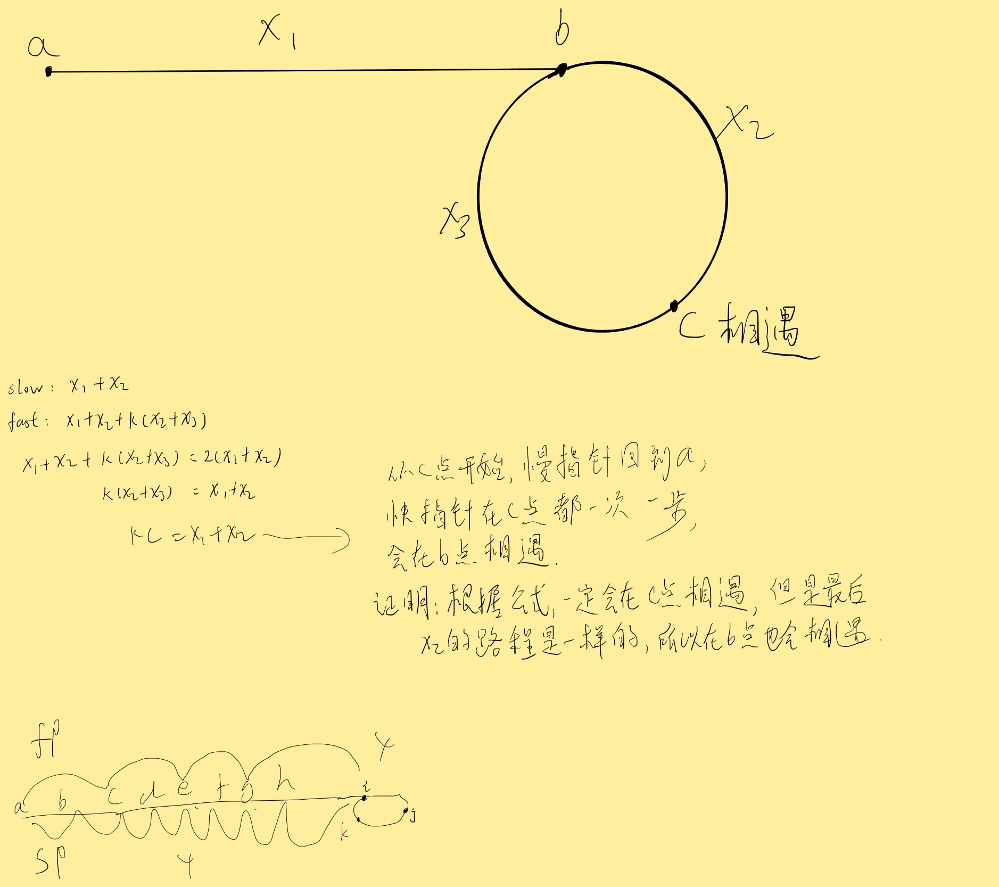

# 怎么判断一个单项链表有环

方法一：

​	从头开始依次遍历单链表中每一个节点，每遍历一个新节点，就从头检查新节点之前的节点是否与当前节点相同。

​	时间复杂度O(n^2)， 空间复杂度O(1)

 

方法二：

​	创建一个HashSet集合，从头开始依次遍历单链表中每一个节点，每遍历一个新节点，检查HashSet集合中是否有相同的元素，若没有则添加到HashSet集合中，若有则说明有环。

​	时间复杂度O(n)， 空间复杂度O(n)

方法三：

​	首先创建两个指针p1和p2，开始都指向链表头节点，然后开始遍历，p1每次向后移动1个节点，p2每次向后移动2个节点，如果两指针指向节点相同，则说明有环。类似于追及问题。

​	时间复杂度O(n)，空间复杂度O(1)

扩展1：如何求出环的长度

1. 检测出环的点继续前进，再到此点，则走的长度为环的长度

 	2. 若用上面方法三，再次相遇时，走的步数为环长度，环长 = 每一次速度差 × 前进次数 = 前进次数。

扩展2：求入环点

假设从链表头节点到入环点的距离是D，从入环点到两个指针首次相遇点的距离是S1，从首次相遇点回到入环点的距离是S2 。

当两个指针首次相遇时，各自所走的距离是多少呢？

指针p1一次只走1步，所走的距离是D+S1 。

指针p2一次走2步，多走了n(n>=1)整圈，所走的距离是D+S1 +n(S1 +S1 )。

由于p2的速度是p1的2倍，所以所走距离也是p1的2倍，因此：

2(D+S1 ) = D+S1 +n(S1 +S2 )

整理得：`D = (n-1)(S1 +S2 )+S2`

也就是说，从链表头结点到入环点的距离，等于从首次相遇点绕环n-1圈再回到入环点的距离。

这样一来，只要把其中一个指针放回到头节点位置，另一个指针保持在首次相遇点，两个指针都是每次向前走1步。那么，它们最终相遇的节点，就是入环节点。

