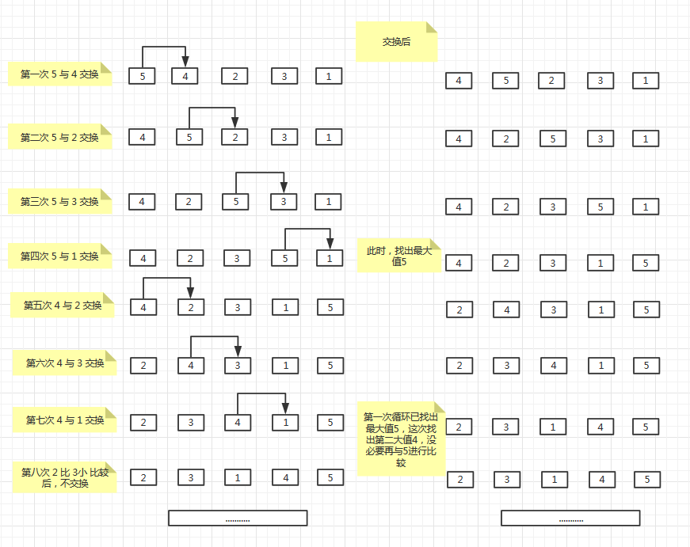

# 冒泡排序原理

​       第一个元素与第二个元素比较，如果第一个元素大，与第二个交换；

​       第二个元素与第三个元素比较，如果第二个元素大，与第三个交换；

​       ....

​       第一次循环，找出最大值

​       ...

​      第二次循环，找出次最大值


图示如下：




实现方式使用两种循环，外层循环控制总共需要循环多少次，内部循环是每一次冒泡处理。

```java
    public void bubbleSort0() {
        int[] arr = {1, 2, 0, 9, 3, 65, 8, 9, 0, 3, 1, 8, 6, 4, 9};
        int len = arr.length;
        for (int i = 0; i < len - 1; i++) {
            for (int j = 0; j < len - 1 - i; j++) {
                if (arr[j] > arr[j + 1]) {
                    int temp = arr[j + 1];
                    arr[j + 1] = arr[j];
                    arr[j] = temp;
                }
            }
        }
        System.out.println(Arrays.toString(arr));
        //[0, 0, 1, 1, 2, 3, 3, 4, 6, 8, 8, 9, 9, 9, 65]
    }
```


时间复杂度O(n^2)