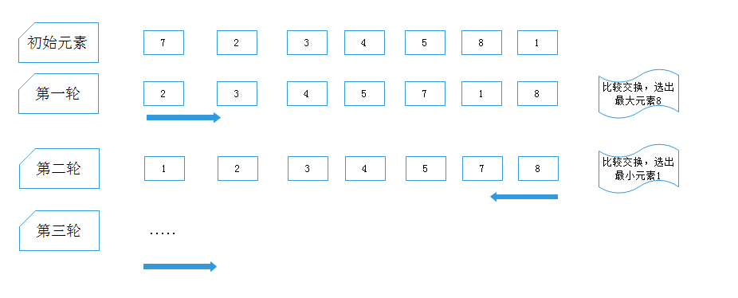

# 鸡尾酒排序原理

冒泡排序的升级版，冒泡排序每次从左向右一点一点的移动，如果遇到{2,3,4,5,6,7,8,1}这种类型的，冒泡排序依旧需要相同次数的循环，鸡尾酒排序第一轮是从左向右，第二轮是从右向左，第三轮从左向右，第四轮从右向左...，从左向右选出了最大元素，从右向左选出了最小元素。如果有小的元素在右侧，可以很快的移动到左侧。




代码：

```java
   public void testCocktailSort() {
        int[] array={2,3,4,5,6,7,8,9,1};

        for(int i =0; i< array.length/2;i++){
            //标记是否已经有序
            boolean isSorted = true; 
            //从左到右的循环
            for(int j = i; j<array.length-i-1;j++){
                if (array[j] > array[j+1]) {
                    int tem = array[j];
                    array[j]=array[j+1];
                    array[j+1] = tem;
                    isSorted=false;
                }
            }
            if(isSorted){
                break;
            }
            //从右到左的循环
            isSorted=true;
            for(int j = array.length-i-1;j>i;j--){
                if(array[j]<array[j-1]){
                    int tem = array[j];
                    array[j]=array[j-1];
                    array[j-1] = tem;
                    isSorted=false;
                }
            }
            if(isSorted){
                break;
            }
        }

        System.out.println(Arrays.toString(array));
    }
```

