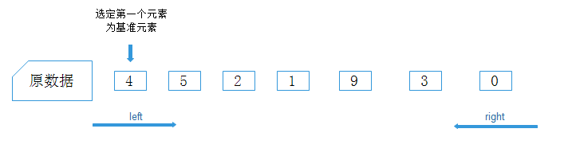
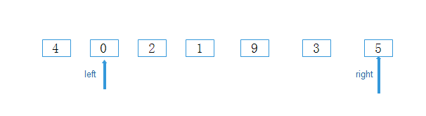
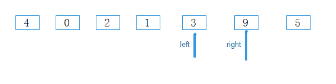
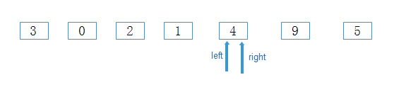

# 快速排序介绍

​	挑选一个基准元素，比基准元素大的移到数列一边，比基准元素小的移到数列另一边，这样数列被拆分成了两部分，然后每部分再挑选一个基准元素，比基准元素小的移到一边，大的移到另一边，依次递归。

​	

排序过程：

首先选定一个基准元素pivot



设置两个指针left和right，分别指向数列最左和最右两个元素

1. right指针向左移动，找到比pivot小的元素，停下，right指针停在0位置
2. left指针向右移动，找到比pivot大的元素，停下，left指针停在5位置

3. left指针值与right指针值进行交换，交换后如图

   

4. 进入第二次循环，right指针左移，找到比pivot小的元素，停下，停在3位置

5. left指针向右移动，找到比pivot大的元素，停下，停在9位置

6. left指针值与right指针值进行交换，交换后如图

   

7. 进入第三次循环，right指针左移动，与left指针重合，把重合点元素与pivot元素进行交换，第一次大的交换完成，比基准元素小的移到左边，比基准元素大的移到了右边

   

8. 分治法，`3 0 2 1` 与 ` 9 5`分别应用上面方法


代码：

```java
 	public void testQuickSort() {
        int[] array = {4,4,2,5,6,0,5,4,4};
        quickSort(array, 0, array.length - 1);
        System.out.println(Arrays.toString(array));
    }

    public void quickSort(int[] arr, int startIndex, int endIndex) {
        if (startIndex >= endIndex) {
            return;
        }

        //基准位置默认第一个元素
        int pivot = arr[startIndex];
        int left = startIndex;
        int right = endIndex;

        while (right > left) {
            //右指针循环左移
            while (left < right && arr[right] > pivot) {
                right--;
            }

            //左指针循环右移
            while (left < right && arr[left] <= pivot) {
                left++;
            }
            if(left<right){
                int tem = arr[left];
                arr[left] = arr[right];
                arr[right] = tem;
            }

        }
        //基准位置重合时left与right交换
        int tem = arr[left];
        arr[left]  = arr[startIndex];
        arr[startIndex] = tem;


        quickSort(arr, startIndex, left - 1);
        quickSort(arr, left + 1, endIndex);

    }
```


平均时间复杂度O(nlogn)，最坏时间复杂度O(n^2)


