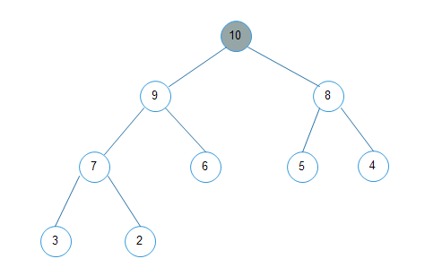
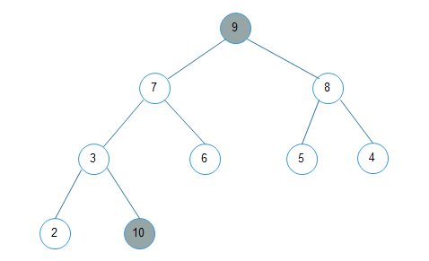
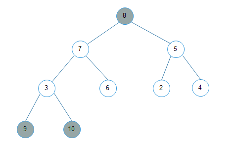
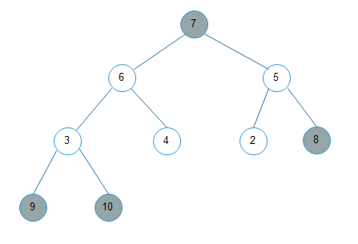

# 堆排序原理

二叉堆特性：

1. 最大堆的堆顶是整个堆中的最大元素
2. 最小堆的堆顶是整个堆中的最小元素

如果每次在最大堆中选出一个最大元素，放在数组最后，那么最终数组列表将是一个从小到大排序的序列。


下图是一个最大堆




1. `10`与`2`交换，重平衡

   

2. `9` 与`2`交换，重平衡

   

3. `8`与`4`交换，重平衡

   

4. `7`与`2`交换，重平衡   ....


首先把序列构造成二叉堆，然后每次拿堆顶与堆最后一个未有序的元素进行交换，重平衡，然后再交换，重平衡...。


代码：

```java
	/**
     * 二叉堆排序原理
     * 调整堆，获取最大元素，与最后一个元素交换，然后再排序，与倒数第二个元素交换
     * 这样就使数组按照顺序由小到大排序了
     *
     * 时间复杂度O(nlogn),空间复杂度O(1)
     */
    @Test
    public void test01(){
        int[] array = new int[]{1,3,5,7,8,2,0,9,1,7};

        //调整二叉堆为有序，(array.length-2)/2为最后一个非叶子结点
        //每个结点依次下沉
        for(int i = (array.length-2)/2; i>=0 ;i--){
            down(array,i,array.length-1);
        }
        System.out.println(Arrays.toString(array));

        //堆顶与尾部未有序的元素依次交换
        for(int i =0;i<array.length-1;i++){
            int temp = array[array.length-i-1];
            array[array.length-i-1] = array[0];
            array[0]  = temp;

            down(array,0,array.length-i-1);
        }
        System.out.println(Arrays.toString(array));

    }

    /**
     * 调整parentIndex元素位置
     * 最大堆
     * @param array 数组
     * @param parentIndex  待下沉元素结点下标
     * @param length 数组长度
     */
    public void down(int[] array, int parentIndex, int length) {
        int temp = array[parentIndex];
        int leftChildIndex = 2 * parentIndex + 1;
        while (leftChildIndex < length) {
            int rightChildIndex = leftChildIndex + 1;
            int index = leftChildIndex;
            //如果有右孩子，比较出两个最大值
            if (rightChildIndex < length && array[rightChildIndex] > array[index]) {
                index = rightChildIndex;
            }
            if (temp >= array[index]) {
                break;
            }
            array[parentIndex] = array[index];
            parentIndex = index;
            leftChildIndex = 2 * parentIndex + 1;
        }
        array[parentIndex] = temp;

    }

    /**
     * 最小堆
     * @param array
     * @param parentIndex
     * @param length
     */
    public void down2(int[] array, int parentIndex, int length) {
        int temp = array[parentIndex];
        int leftChildIndex = 2 * parentIndex + 1;
        while (leftChildIndex < length) {
            int rightChildIndex = leftChildIndex + 1;
            int index = leftChildIndex;
            //如果有右孩子，比较出两个最小值
            if (rightChildIndex < length && array[rightChildIndex] < array[index]) {
                index = rightChildIndex;
            }
            if (temp <= array[index]) {
                break;
            }
            array[parentIndex] = array[index];
            parentIndex = index;
            leftChildIndex = 2 * parentIndex + 1;
        }
        array[parentIndex] = temp;

    }
```


平均时间复杂度与最坏时间复杂度都是O(nlogn)