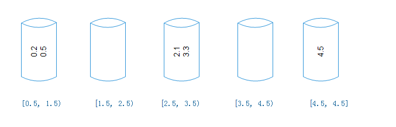

# 桶排序原理

类似于计数排序所创建的统计数组，桶排序需要创建若干个桶来协助排序。每一个桶代表一个区间范围，里面可以装载多个元素。

例如：

​	非整数数组：4.5   0.2    3.3    2.1    0.5

1. 创建桶，并确定桶的区间范围，假设桶的数量与原始数列的元素数量相同，除最后一个桶只包含数列最大值外，前面各个桶的区间按照比例来确定

   ​	区间跨度=（最大值-最小值）/（桶的数量-1）

2. 遍历原始数列，把元素对号放入各个桶中

​	

3. 对每个桶内部的元素分别进行排序，只有第三个桶需要排序

   

4. 遍历所有的桶，输出所有元素