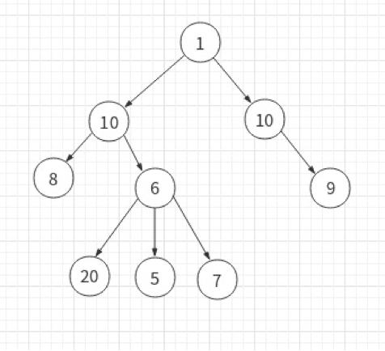
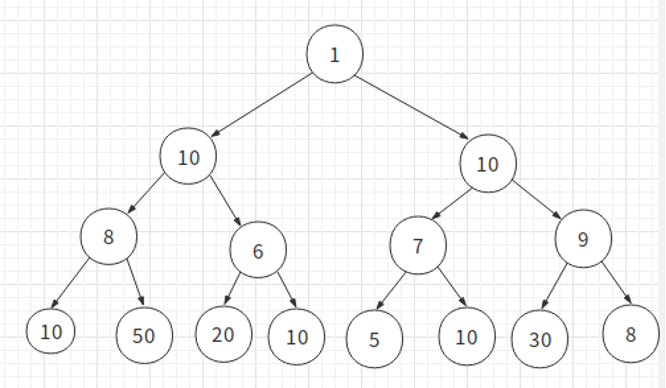
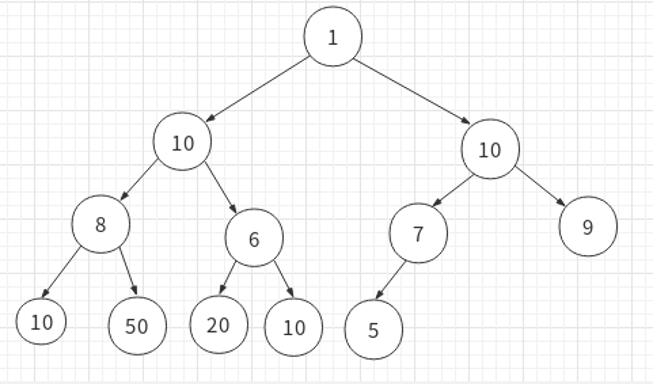
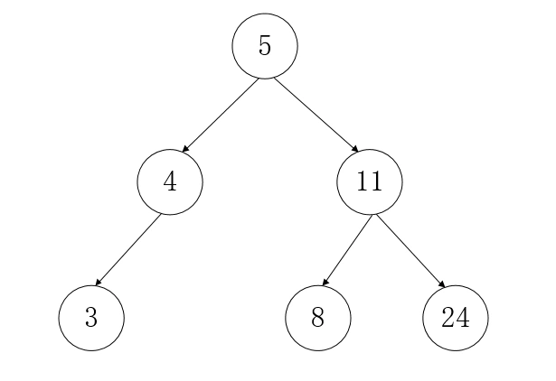
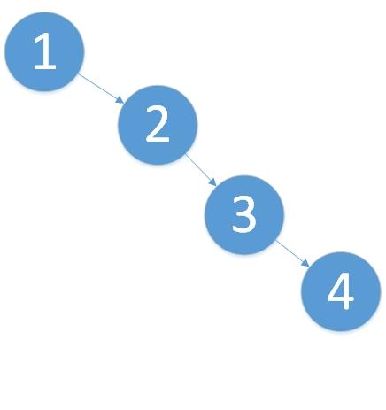

# 树概念

## 1. 树的定义

树是由结点或顶点和边组成的且不存在环的一种数据结构（可能是线性的）。没有结点的树称为空树，一个非空的树包含一个根节点也可能有其它结点构成的一个层级结构

一些术语：

度：某结点所拥有的子结点个数称为结点的度

层：根结点在第0层，依次类推

结点高度：该结点与叶子结点之间最长路径的边的个数

## 2. 二叉树

每个结点最多拥有两个子结点（即度不能大于2），二叉树的结点有左右之分。

性质：

1.第i层最多有2^i个结点（i从0开始）

2.高度为k的二叉树，最多有2^(k+1)-1个结点（空树的高度为-1）

3.对任何一个二叉树，如果其叶子结点树为m，度为2的结点数为n，则m=n+1

## 3. 满二叉树

从根节点到最后一层，结点都是满的二叉树，即2^(k+1)-1个结点的二叉树，也称为完美二叉树。

## 4. 完全二叉树

从根节点到倒数第二层为满二叉树，最后一层向左对其的二叉树

## 5. 二叉查找树

二叉查找树（Binary Search Tree），（又：二叉搜索树，二叉排序树）它或者是一棵空树，或者是具有下列性质的二叉树： 若它的左子树不空，则左子树上所有结点的值均小于它的根结点的值； 若它的右子树不空，则右子树上所有结点的值均大于它的根结点的值； 它的左、右子树也分别为二叉查找树。

二叉查找树必须满足：

　1.所有子树上面的左节点的值都比根结点要小，右节点的值都比根结点要大 

　2.任意结点的左右子树也都是二叉查找树

　3.通过中序遍历，将得到的是一个有序的数列

对其操作的最优的时间复杂度为O(log2n)，相当于对数列进行二分查找法。最坏的时间复杂度为O(n)，相当于线性查找。

 

## 6. 平衡二叉树

平衡二叉树（Balanced Binary Tree）又被称为AVL树（有别于AVL算法），它是二叉查找树最优的情况。它很好的解决了二叉查找树退化成链表的问题，把插入，查找，删除的时间复杂度最好情况和最坏情况都维持在O(logN)。但是频繁旋转会使插入和删除牺牲掉O(logN)左右的时间，不过相对二叉查找树来说，时间上稳定了很多。

且具有以下性质：

　1.它是一个二叉查找树

​	2.它的左右两个子树的高度差的绝对值不超过1，并且左右两个子树都是一棵平衡二叉树。

　3.当删除、新增、修改节点上的值时，它会通过左旋或右旋的操作使二叉树保持平衡。

　4.最坏的时间复杂度为O(log2n)

## 7. 红黑树

它是一种二叉查找树，但在每个节点增加一个存储位表示节点的颜色，可以是红或黑（非红即黑）。通过对任何一条从根到叶子的路径上各个节点着色的方式的限制，**红黑树确保没有一条路径会比其它路径长出两倍（这里是和平衡二叉树的主要区别）**，因此，红黑树是一种弱平衡二叉树（由于是弱平衡，可以看到，在相同的节点情况下，AVL树的高度低于红黑树），相对于要求严格的AVL树来说，它的旋转次数少，所以**对于搜索，插入，删除操作较多的情况下，我们就用红黑树。如果应用场景中对插入删除不频繁，只是对查找要求较高，那么AVL还是较优于红黑树。**

