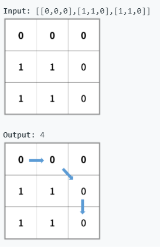

# Shortest Path in Binary Matrix



最短路径，BFS，每次记录走过路径

```java
class Solution {
    public int shortestPathBinaryMatrix(int[][] grids) {

        if (grids == null || grids.length == 0 || grids[0].length == 0) {
            return -1;
        }
        int[][] direction = {{1, -1}, {1, 0}, {1, 1}, {0, -1}, {0, 1}, {-1, -1}, {-1, 0}, {-1, 1}};
        int m = grids.length, n = grids[0].length;
        Queue<Pair> queue = new LinkedList<>();
        queue.add(new Pair(0, 0));
        int pathLength = 0;
        while (!queue.isEmpty()) {
            int size = queue.size();
            pathLength++;
            while (size-- > 0) {
                Pair cur = queue.poll();
                int cr = cur.getKey(), cc = cur.getValue();
                if (grids[cr][cc] == 1) {
                    continue;
                }
                if (cr == m - 1 && cc == n - 1) {
                    return pathLength;
                }
                // 标记
                grids[cr][cc] = 1;
                for (int[] d : direction) {
                    int nr = cr + d[0], nc = cc + d[1];
                    if (nr < 0 || nr >= m || nc < 0 || nc >= n) {
                        continue;
                    }
                    queue.add(new Pair(nr, nc));
                }
            }
        }
        return -1;
    }
}
class Pair{
    private int key;
    private int value;

    public Pair(int key, int value) {
        this.key = key;
        this.value = value;
    }

    public int getKey() {
        return key;
    }

    public void setKey(int key) {
        this.key = key;
    }

    public int getValue() {
        return value;
    }

    public void setValue(int value) {
        this.value = value;
    }
}

```

